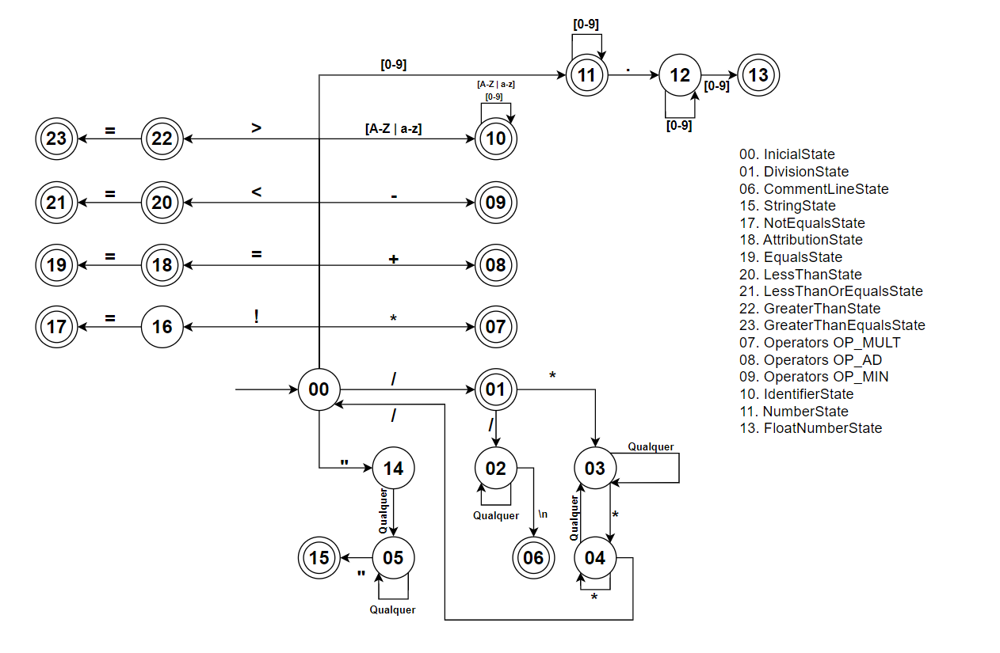

# PASC

Compilador da linguagem PasC.

## Colaboradores

- *11725810*  Cleiton Ribeiro
- *11724814*  Lucas Gabriel de Souza Dutra
- *11722919*  Higor Barbosa

## Pré-requisitos

- JDK 16
- Maven 3.6

## Dúvidas

- Qual a necessidade de contar tabulação? Conta mais na coluna
- Não case sensitive e apenas para identificadores? Identificadores palavras reservadas
- Verdadeiro e falso não serão representados?
- **_Aspas não são tokes_** Significa que não devemos contabilizar-las nos tokens?
- A tabela de símbolos irá armazenar local da declaração? O que colocar para palavras reservadas?
- String vazia é permitido?

## Autômato Determinístico

    

